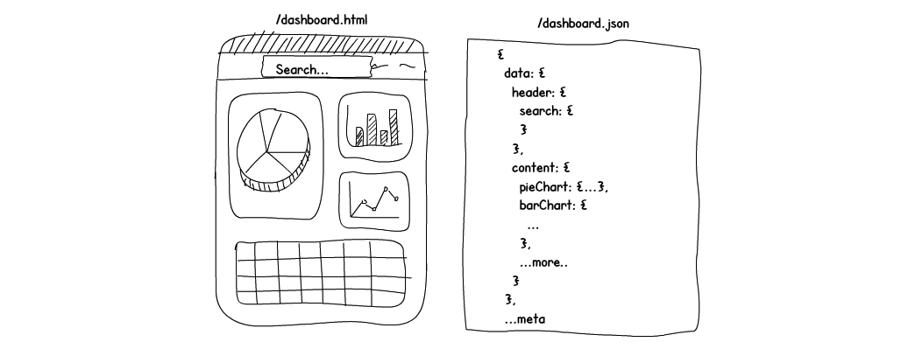
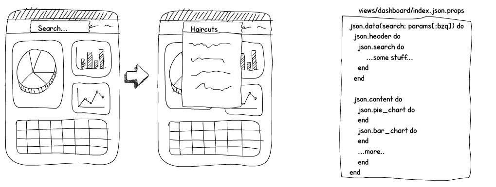

# Breezy

[](https://travis-ci.org/jho406/Breezy)

Build modern React/Redux applications using classic Rails. Batteries included. Turbolinks inspired. APIs not required.

## At a Glance
Breezy is a set of libraries that helps with data and navigation. It comes with thunks, an opinonated redux state shape, a JBuilder inspired traversable templating library, and many more tools that compliments classic Rails.


### No APIs

Instead of APIs, Breezy leans on Rail's ability to respond to different [mime types](https://apidock.com/rails/ActionController/MimeResponds/InstanceMethods/respond_to) on the same route. In a Breezy application, if you directed your browser to `/dashboard.html`, you would see the HTML version of the content, and if you went to `/dashboard.json` you would see the JSON version of the exact same content down to the footer.

The end result would be something like this:



### Powered by Classic Rails
Breezy is mostly classic Rails. Features like the flash, cookie auth, and url helpers continue to be useful. Here's a look at the directory structure of a typical Rails application with Breezy.

```
MyRailsApp/
  app/
    views/
      dashboard/
        index.jsx <- Gets packaged with application.js
        index.json.props
```

### PropsTemplate
Powering these JSON responses is PropsTemplate, a traversable JSON templating language inspired by JBuilder. With PropsTemplate you can specify a path of the node you want, and PropsTemplate will walk the tree to it, skipping execution of nodes that don't match the keypath.

### All together now!
Breezy comes with batteries that bring all the above concepts together to make building popular SPA features easy, painless, and as productive.

#### SPA Navigation
A popular ask of SPAs is page-to-page navigation without reloading. If you were on `/dashboard` and you wanted to click on a link to go to `/posts` without a hard reload, you would use the `visit` thunk in your `onClick` handler:

```
  this.visit('/posts')
```

The above will request for `/posts` with an accept of `application/json`, and when the client receives the response, swap out the current component for the component the response asks for, and `pushState` on history.

#### Same-page updates
Other features of SPA rely on updating some part of the existing page. Breezy provides `remote`, a thunk you can use to update parts of your content in async fashion.

Imagine having to implement search, where you enter some text, hit enter, and results would show without reloading the screen. In traditional applications, you may need a new controller, routes, a discussion over versioning, JSON serializer, plenty of new JS code, etc.



With Breezy, one line of code is enough:
```
  this.remote('/dashboard?qry=haircut&bzq=data.header.search')
```

The above will make a request to `/dashboard?qry=haircut`, walk your props to the `data.header.search` node, return it in a response, and immutably graft it in the exact same path on the redux store before finally letting React re-render.

For more on what you can do, checkout our documentation.

## Documentation

Documentation is hosted on [Gitbook](https://jho406.gitbook.io/breezy). Be sure to select the correct version. `master` will always be in development.

## Special Thanks

Thanks to [jbuilder](https://github.com/rails/jbuilder), [scour](https://github.com/rstacruz/scour), [turbolinks3](https://github.com/turbolinks/turbolinks-classic), [turbograft](https://github.com/Shopify/turbograft/)
